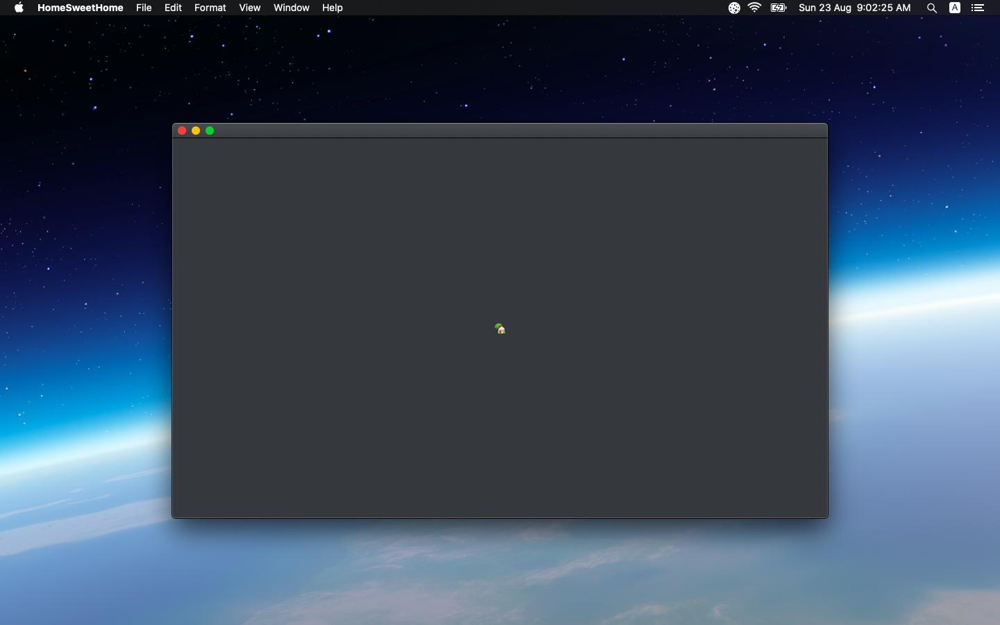

[macos] connect to wifi on external monitor connect/disconnect

https://apple.stackexchange.com/questions/399513/is-there-a-way-to-make-my-macbook-automatically-execute-a-script-every-time-i-co

> [Is there a way to make my macbook automatically execute a script every time I connect it to an external monitor?](https://apple.stackexchange.com/questions/399513/is-there-a-way-to-make-my-macbook-automatically-execute-a-script-every-time-i-co)
Asked 5 years, 2 months ago
Modified [2 years, 4 months ago](https://apple.stackexchange.com/questions/399513/is-there-a-way-to-make-my-macbook-automatically-execute-a-script-every-time-i-co?lastactivity)
Viewed 707 times
5
>
> I would like to make my macbook automatically connect to a specific wifi and launch [Lunar](https://lunar.fyi/) everytime I connect it to my external monitor, and vice versa when I unplug it, but don't know where to start...
>
> I could write a script that keeps checking whether or not an external monitor is connected every, for example, 60 seconds, but I would like to do something like "event driven" that is neither checking nor doing anything at all until an event ("external monitor plugged" or "external monitor unplugged") occurs.
>
> Any hint?

> No one answered and I'm still looking for a simpler solution but I've found a workaround creating a little SwiftUI app.
>
> It's basically just a Text object that listens for [didChangeScreenParametersNotification](https://developer.apple.com/documentation/appkit/nsapplication/1428749-didchangescreenparametersnotific). Since the Text object must be alive in order to listen for notifications, an istance of the app must always be opened or minimized (does anyone have any idea on how to avoid this?). Every time it receives a notification, it checks the number of connected displays, if there's only one display connected, it executes my disconnect script, else it executes my connect script.
>
> [This](https://superuser.com/questions/286457/connect-to-wifi-network-using-mac-terminal) helped me connecting to a wifi programmatically

> asked Aug 17, 2020 at 18:15
>
> answered Aug 23, 2020 at 7:08

